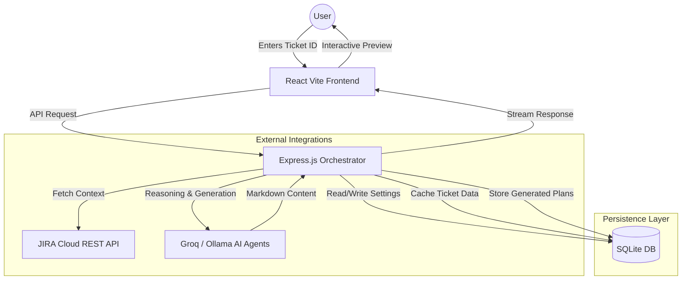
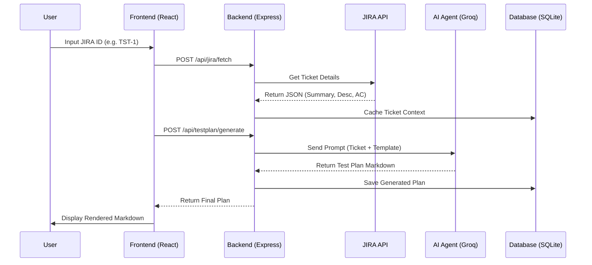

# 🤖 Intelligent Test Plan Generator (AI Agents + JIRA)

[](https://opensource.org/licenses/MIT)
[](https://nodejs.org/)
[](https://reactjs.org/)

**Intelligent Test Plan Generator** is a powerful full-stack application that leverages AI Agents and Groq LLM to automatically generate comprehensive software test plans directly from JIRA Epics or User Stories.

## 🌟 Key Features

- **JIRA Integration**: Fetch Epics, Stories, and Tasks directly using the JIRA REST API.
- **AI-Powered Generation**: Uses Groq (or local Ollama) to analyze requirements and generate structured test plans.
- **Dynamic Templates**: Choose from various test plan templates (Standard, Agile, Regulatory, etc.).
- **Modern Dashboard**: A sleek, responsive UI built with React, Shadcn UI, and Tailwind CSS.
- **SQLite Storage**: Local persistence for generated test plans and configurations.
- **B.L.A.S.T. Protocol**: Built using the Blueprint, Link, Architect, Stylize, Trigger methodology for reliable AI automation.

---

## 🧪 Methodology
This project implements the **B.L.A.S.T.** protocol to ensure deterministic AI agent behavior. It features:
- **Self-Annealing Logic**: Automatic repair loops for failed tools.
- **Data-First Rule**: Mandatory schema definitions before code execution.
- **3-Layer Architecture**: Separation of concerns between SOPs, Reasoning, and Tools.

You can find the full protocol definition in [BLAST.md](./BLAST.md).

## 🏗️ Architecture & System Design

### High-Level Data Flow
The application follows a modern agentic architecture where the backend acts as an orchestrator between JIRA (Data Source) and LLMs (Intelligence Layer).



### Component Interaction (Sequence)


---

## 🛠️ Tech Stack

### Frontend
- **Framework**: React 18 (Vite)
- **Styling**: Tailwind CSS, Shadcn/UI
- **Icons**: Lucide-React
- **Routing**: React Router DOM

### Backend
- **Environment**: Node.js, Express
- **LLM SDK**: Groq-SDK / Ollama
- **JIRA SDK**: jira.js
- **Database**: SQLite3
- **Language**: TypeScript

---

## 📂 Project Structure

```text
Project-Root/
├── intelligent-test-plan-agent/
│   ├── backend/           # Express server & AI Logic
│   │   ├── src/
│   │   │   ├── database/  # SQLite & Schema
│   │   │   ├── routes/    # API Endpoints
│   │   │   ├── services/  # Jira & LLM wrappers
│   ├── frontend/          # React Vite App
│   │   ├── src/           # UI Components & Hooks
│   ├── data/              # SQLite Database file
├── docs/
│   └── RUN_GUIDE.md       # Detailed technical setup and run guide
├── BLAST.md               # B.L.A.S.T. Master System Prompt & Protocol
└── README.md              # Project Overview
```

---

## 🚀 Quick Start

### 1. Prerequisites
- Node.js (v18+)
- JIRA API Token
- Groq API Key

### 2. Setup
Create a `.env` file in `intelligent-test-plan-agent/backend/`:
```env
JIRA_BASE_URL=https://your-domain.atlassian.net
JIRA_USERNAME=your-email@example.com
JIRA_API_TOKEN=your-jira-api-token
GROQ_API_KEY=your-groq-api-key
```

### 3. Install & Run
```bash
# Install backend
cd intelligent-test-plan-agent/backend && npm install

# Initialize DB
npm run db:init

# Start Backend
npm run dev

# (New Terminal) Install frontend
cd ../frontend && npm install

# Start Frontend
npm run dev
```

---

## 📋 Roadmap
- [ ] Export Test Plans to PDF/Docx.
- [ ] Multi-agent collaborative analysis.
- [ ] Support for Azure DevOps integration.
- [ ] Test coverage visualization charts.

## 📄 License
Distributed under the MIT License. See `LICENSE` for more information.

---
Developed with ❤️ by [Karan Atreya](https://github.com/karanAtreya1986)
